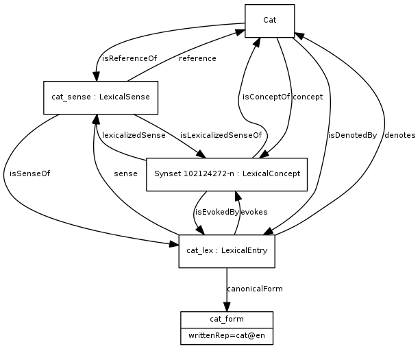

DanNet
======
[DanNet](https://cst.ku.dk/projekter/dannet/) is a [WordNet](https://en.wikipedia.org/wiki/WordNet) for the Danish language. The goal of this project is to represent DanNet in full using [RDF](https://www.w3.org/RDF/) as its native representation at both the database level, in the application space, and as its primary serialisation format.

The initial dataset has been [bootstrapped from the old DanNet 2.2 CSV files](src/main/dk/cst/dannet/bootstrap.clj). The old CSV export mirrors the SQL tables of the old DanNet database. This process will eventually be made obsolete once the next version of DanNet has been published.

Compatibility
-------------
Special care has been taken to maximise the compatibility of this iteration of DanNet. Like the DanNet of yore, the base dataset of this iteration is published as both RDF and CSV; the CSV file now simply reflects the triples of the RDF representation.

### Alternative and companion datasets
Apart from the base DaNet dataset, several **alternative datasets** exist that contain additional data.

This additional data can be implicitly inferred from the base dataset and its associated ontological metadata, but doing so can be both computationally expensive and mentally taxing for the consumer of the data. The alternative datasets provide a broader view of the data where implicit links to other ontologies have already been reified as triples within the dataset.

Published alongside DanNet are also **companion datasets** exist which link DanNet resources directly to other resources, e.g. the COR companion dataset that links DanNet resources to IDs from the COR project.

### Standards-based
The previous version of DanNet was modelled as tables inside a relational database. Two serialised representations also exist: [RDF/XML 1.0](https://www.w3.org/TR/2004/REC-rdf-syntax-grammar-20040210/) and a custom CSV format. The latter now serves as input for the new data model, remapping the relations described in these files onto a modern WordNet based on the [Ontolex-lemon](https://www.w3.org/2016/05/ontolex/) standard combined with the various [relations](https://globalwordnet.github.io/gwadoc/) defined by the Global Wordnet Association as used in the official [GWA RDF standard](https://globalwordnet.github.io/schemas/#rdf).

In Ontolex-lemon...

* Synsets are analogous to `ontolex:LexicalConcept`.
* Wordsenses are analogous to `ontolex:LexicalSense`.
* Words are analogous to `ontolex:LexicalEntry`.
* Forms are analogous to `ontolex:Form`.



By choosing these standards, we maximise DanNet's ability to integrate with other lexical resources, in particular with other WordNets.

### Clojure support
In its native Clojure representation, DanNet can be queried in a variety of ways (described in [queries.md](doc/queries.md)). It is especially convenient to query data from within a Clojure REPL.

Support for Apache Jena transactions is built-in and enabled automatically when needed. This ensures support for persistence on disk through the [TDB](https://jena.apache.org/documentation/tdb/) layer included with Apache Jena (mandatory for [TDB 2](https://jena.apache.org/documentation/tdb2/)). Both in-memory and persisted graphs can thus be queried using the same function calls.

Furthermore, DanNet query results are all decorated with support for the Clojure `Navigable` protocol. The entire RDF graph can therefore easily be navigated in tools such as [REBL](https://docs.datomic.com/cloud/other-tools/REBL.html) or [Reveal](https://github.com/vlaaad/reveal) from a single query result. 

Significant changes
-------------------

### New schema, prefixes, URIs
DanNet uses a new schema, [available in this repository](resources/schemas/internal/dannet-schema-2022.ttl) and eventually at https://wordnet.dk/dannet/2022/schema/. 

DanNet uses the following URI prefixes for the dataset instances, concepts (the range of `dns:ontologicalFacet` and `dns:ontologicalType`) and the schema itself:

* `dn` -> https://wordnet.dk/dannet/data/
* `dnc` -> https://wordnet.dk/dannet/concepts/
* `dns` -> https://wordnet.dk/dannet/schema/

These new prefixes/URIs take over from the ones used for DanNet 2.2:

* `dn` -> http://www.wordnet.dk/owl/instance/2009/03/instances/
* `dn_schema` -> http://www.wordnet.dk/owl/instance/2009/03/schema/

Eventually, all of these new URIs should resolve to schema files, which is to say that accessing a resource with a GET request (e.g. through a web browser) should always return data for the resource (or schema) in question.

The new DanNet schema is written in accordance with the [RDF conventions](http://www-sop.inria.fr/acacia/personnel/phmartin/RDF/conventions.html#reversingRelations) listed by Philippe Martin.

Implementation
--------------
The main database that the new tooling has been developed for is [Apache Jena](https://jena.apache.org/), which is a mature RDF triplestore that also supports [OWL](https://www.w3.org/OWL/). When represented inside Jena, the many relations of DanNet are turned into a queryable [knowledge graph](https://en.wikipedia.org/wiki/Knowledge_graph). The new DanNet is developed in the Clojure programming language (an alternative to Java on the JVM) which has multiple libraries for interacting with the Java-based Apache Jena, e.g. [Aristotle](https://github.com/arachne-framework/aristotle) and [igraph-jena](https://github.com/ont-app/igraph-jena).

However, standardising on the basic RDF triple abstraction does open up a world of alternative data stores, query languages, and graph algorithms. See [rationale.md](doc/rationale.md) for more.

Web app
-------
> Note: A more detailed explanation is available at [doc/web.md](doc/web.md).

The IRIs of each of the resources in DanNet resolve to actual HTML pages with content relating to the resource at the IRI. The frontend is built using [Rum](https://github.com/tonsky/rum) and is served by [Pedestal](https://github.com/pedestal/pedestal) in the backend. If JavaScript is turned on, the initial HTML page becomes the entrypoint of a single-page app. If JavaScript is unavailable, this web app converts to a regular HTML website with some animations and the more dynamic features disabled.

### Architecture
Every DanNet resource accessible through a web browser has both an HTML representation and several _other_ representations which can be accessed via HTTP content negotiation. When JavaScript is disabled, usually only the HTML representation is used by the browser. However, when JavaScript _is_ available, a frontend router ([reitit](https://github.com/metosin/reitit)) reroutes all navigation requests (e.g. clicking a hyperlink or submitting a form) towards fetching the `application/transit+json` representation instead. This data is used to refresh the Rum components, allowing them to update in place, while "fake" browser history item is inserted by reitit. The very same Rum components are also used to render the static HTML webpages.

Language negotiation is used to select the most suitable RDF data when multiple languages are available in the dataset.

Bootstrap
---------
This new version of DanNet is bootstrapped from the so-called CSV export of the previous version of DanNet. This is a two-step process which happens in two separate namespaces:

* [dk.cst.dannet.bootstrap](/src/main/dk/cst/dannet/bootstrap.clj): the raw data from the previous version of DanNet is loaded into memory, cleaned up, and converted into triple data structures using the new RDF schema structure.
* [dk.cst.dannet.db](/src/main/dk/cst/dannet/db.clj): these triples are imported into an Apache Jena graph. Additional triples are either inferred through OWL schemas or added programmatically via queries.

Finally, on the final run of this bootstrap process, the graph is exported into an RDF dataset. This dataset constitutes the new official version of DanNet.

> NOTE: the data used for bootstrapping should be located inside the `./boostrap` subdirectory (relative to the execution directory).

Setup
-----
The code is all written in Clojure and it must be compiled to Java Bytecode and run inside a Java Virtual Machine (JVM). The primary means to do this is Clojure's [official CLI tools](https://clojure.org/guides/deps_and_cli) which can both fetch dependencies and build/run Clojure code. The project dependencies are specified in the [deps.edn file](deps.edn).

### Testing a release build
While developing, ideally you should be running code in a Clojure REPL.

However, when testing release you can either run the docker compose setup from inside the `./docker` directory using the following command:

```shell
docker compose up --build
```

Usually, the Caddy container can keep running in between restarts, i.e. only the DanNet container should be rebuilt:

```shell
docker compose up -d dannet --build
```

> NOTE: requires that the Docker daemon is installed and running!

Or you may build and run a new release manually from this directory:

```shell
shadow-cljs --aliases :frontend release app
clojure -T:build org.corfield.build/uber :lib dk.cst/dannet :main dk.cst.dannet.web.service :uber-file "\"dannet.jar\""
java -jar -Xmx4g dannet.jar
```

> NOTE: requires that Java, Clojure, and shadow-cljs are all installed.

By default, the web service is accessed on `localhost:3456`. The data is loaded into a TDB2 database located in the `./db/tdb2` directory.

### Input data
This project assumes that the [ZIP-files containing DanNet 2.2](https://cst.ku.dk/english/projects/dannet/) have been downloaded in advance and extracted into a subdirectory called "resources":

- `bootstrap/dannet/`: contains the old DanNet CSV files. These are used to bootstrap the initial dataset. Eventually, this bootstrap code will be made obsolete by the release of new the DanNet dataset.

### Memory usage
Currently, the entire system, including the web service, uses ~1.4 GB when idle and ~3GB when rebuilding the Apache Jena database. A server should therefore have perhaps 4GB of available RAM to run the full version of DanNet.

### Frontend dependencies
```shell
npm init -y
npm install react react-dom create-react-class
```

Querying DanNet
---------------
The easiest way to query DanNet currently is by compiling and running the Clojure code, then navigating to the `dk.cst.dannet.db` namespace in the Clojure REPL. From there, you can use a variety of query methods as described in [queries.md](doc/queries.md).

At the moment, there is no graphical user interface available for querying DanNet - that is still to come! One option might be setting up [Apache Jena Fuseki](https://jena.apache.org/documentation/fuseki2/), which is a web-based application for querying Apache Jena using SPARQL. This requires either setting up DanNet as a persistent [TDB database](https://jena.apache.org/documentation/tdb/index.html) or creating as Fuseki instance from a published DanNet dataset.
