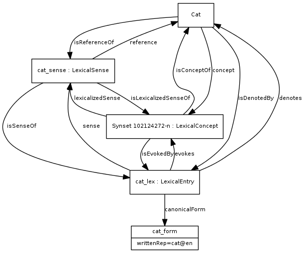
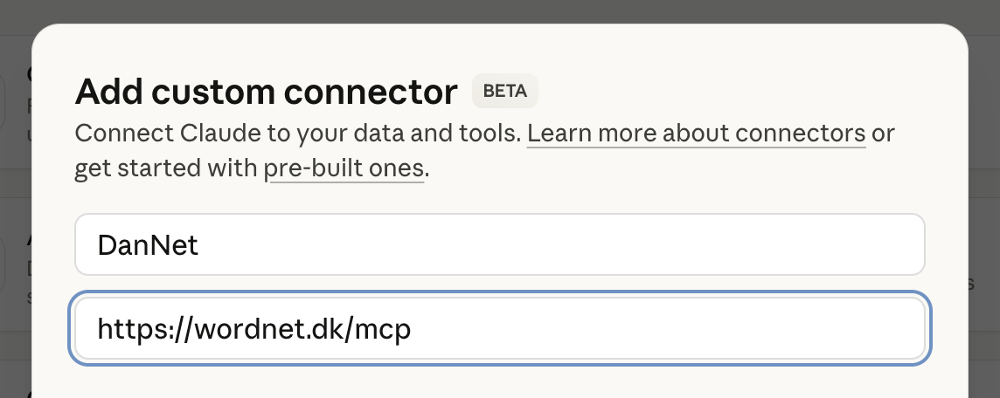

[DanNet](https://cst.ku.dk/projekter/dannet/) is a [WordNet](https://en.wikipedia.org/wiki/WordNet) for the Danish language. DanNet uses [RDF](https://www.w3.org/RDF/) as its native representation at both the database level, in the application space, and as its primary serialisation format.

- Browse the data at [wordnet.dk](https://wordnet.dk)
- Query the data by [integrating with AI](#llm-integration)
- Download datasets from the [releases page](https://github.com/kuhumcst/DanNet/releases)

## Table of Contents
- [Dataset Formats](#dataset-formats)
- [Companion Datasets](#companion-datasets)
- [Standards](#standards)
- [LLM Integration](#llm-integration) (AI)
- [Implementation](#implementation)
- [Setup](#setup)
- [Deployment](#deployment)
- [Database Release Workflow](#database-release-workflow)

## Dataset Formats

DanNet is available in multiple formats to maximise compatibility:

| Format | Description                                                                                                                                 |
|--------|---------------------------------------------------------------------------------------------------------------------------------------------|
| **RDF (Turtle)** | Native representation. Load into any RDF graph database (such as Apache Jena) and query with [SPARQL](https://en.wikipedia.org/wiki/SPARQL). |
| **CSV** | Published with column metadata as [CSVW](https://csvw.org/).                                                                                |
| **WN-LMF** | [XML format](https://globalwordnet.github.io/schemas/#xml) compatible with Python libraries like [wn](https://github.com/goodmami/wn).      |
| **DMLex** | [OASIS DMLex 1.0](https://docs.oasis-open.org/lexidma/dmlex/v1.0/os/dmlex-v1.0-os.html) representation as both XML and JSON, in a Danish and an English variant. The [DMLex browser](https://github.com/kuhumcst/DMLex-browser) shows it as a dictionary. |

### Example: Using DanNet with Python

```python
import wn

wn.add("dannet-wn-lmf.xml.gz")

for synset in wn.synsets('kage'):
    print((synset.lexfile() or "?") + ": " + (synset.definition() or "?"))
```

### Differences Between Formats

While every format includes all synsets/senses/words, the CSV, WN-LMF and DMLex variants do *not* include every data point:
- **CSV**: Some data is lost when converting from an open graph to fixed tables.
- **WN-LMF**: Only official GWA relations are included per the standard (proprietary DanNet relations from the [DanNet schema](/resources/schemas/internal/dannet-schema.ttl) are excluded).
- **DMLex**: Combines DanNet with COR, DDS and COR.SEM in one file. Relations to other datasets are not included. See [doc/dmlex/plan.md](/doc/dmlex/plan.md) for the conversion rules.

For the complete dataset, use the RDF format or browse at [wordnet.dk](https://wordnet.dk).

## Companion Datasets

Several companion datasets expand the RDF graph with additional data:

| Dataset | Description |
|---------|-------------|
| **COR** | Links DanNet resources to IDs from the COR project. |
| **DDS** | Adds sentiment data to DanNet resources. |
| **OEWN extension** | Provides DanNet-style labels for the [Open English WordNet](https://en-word.net/) to facilitate browsing connections between the two datasets. |

### Inferred Data

Additional data is implicitly inferred from the base dataset, companion datasets, and ontological metadata. These inferences can be browsed at [wordnet.dk](https://wordnet.dk). Releases containing fully inferred graphs are specifically marked as such.

## Standards

DanNet is based on the [Ontolex-lemon](https://www.w3.org/2016/05/ontolex/) standard combined with [relations](https://globalwordnet.github.io/gwadoc/) defined by the Global Wordnet Association as used in the official [GWA RDF standard](https://globalwordnet.github.io/schemas/#rdf).

| Ontolex-lemon class | Represents |
|---------------------|------------|
| `ontolex:LexicalConcept` | Synsets |
| `ontolex:LexicalSense` | Word senses |
| `ontolex:LexicalEntry` | Words |
| `ontolex:Form` | Forms |



### URI Prefixes

| Prefix | URI | Purpose |
|--------|-----|---------|
| `dn` | https://wordnet.dk/dannet/data/ | Dataset instances |
| `dnc` | https://wordnet.dk/dannet/concepts/ | Ontological type members |
| `dns` | https://wordnet.dk/dannet/schema/ | Schema definitions |
| `dnf` | https://wordnet.dk/dannet/function/ | Custom SPARQL functions (`dnf:path`, `dnf:lch`, `dnf:wup` synset similarity) |

All DanNet URIs resolve to HTTP resources. Accessing one of these URIs via a GET request returns the data for that resource.

### Schemas

DanNet has proprietary relations defined in the [DanNet schema](/resources/schemas/internal/dannet-schema.ttl) in an Ontolex-compatible way. There is also a schema for [EuroWordNet concepts](/resources/schemas/internal/dannet-concepts.ttl). Both schemas follow the [RDF conventions](http://www-sop.inria.fr/acacia/personnel/phmartin/RDF/conventions.html#reversingRelations) listed by Philippe Martin.

## LLM Integration

DanNet can be connected to AI tools like Claude via MCP (Model Context Protocol).

- **MCP server URL**: `https://wordnet.dk/mcp`
- **Registry ID**: `io.github.kuhumcst/dannet`

To connect in e.g. Claude Desktop: go to `Settings > Connectors > Browse Connectors`, click "add a custom one", enter a name (e.g., "DanNet") and the MCP server URL.



Once connected, you can query DanNet's semantic relations directly through Claude.

## Implementation

The database backend is [Apache Jena](https://jena.apache.org/), a mature RDF triplestore with [OWL](https://www.w3.org/OWL/) inference support. When represented in Jena, DanNet's relations form a queryable [knowledge graph](https://en.wikipedia.org/wiki/Knowledge_graph). DanNet is developed in Clojure, using libraries like [Aristotle](https://github.com/arachne-framework/aristotle) to interact with Jena.

See [rationale.md](pages/rationale-en.md) for more on the design decisions.

### Full Production Setup

The production deployment at wordnet.dk consists of three services managed via Docker Compose:

- **DanNet** — the Clojure/ClojureScript web application
- **MCP server** — a Python-based [MCP server](mcp/) providing LLM access to DanNet
- **Caddy** — reverse proxy handling HTTPS and routing

### Clojure Support

DanNet can be queried in various ways from Clojure (see [queries.md](pages/queries-en.md)). Apache Jena transactions are built-in and enable persistence via the [TDB 2](https://jena.apache.org/documentation/tdb2/) layer.

### Web Application

The frontend is written in [ClojureScript](https://clojurescript.org/) using [Rum](https://github.com/tonsky/rum), served by [Pedestal](https://github.com/pedestal/pedestal). The app works both as a single-page application (with JavaScript) and as a regular HTML website (without). Content negotiation serves different representations (HTML, RDF, Transit+JSON) based on the request.

See [doc/web.md](doc/web.md) for details.

### Bootstrap Process

New releases are bootstrapped from the [preceding release](https://github.com/kuhumcst/DanNet/releases). The process (in [dk.cst.dannet.db.bootstrap](src/main/dk/cst/dannet/db/bootstrap.clj)):

1. Load and clean the previous version's RDF data
2. Convert to triples using the current schema
3. Import into Apache Jena graphs and apply release changes (only when cutting a release, i.e. when `to` differs from `from`)
4. Infer additional triples via [OWL/RDFS schemas](/resources/schemas/)
5. Export the final RDF dataset (see [Database Release Workflow](#database-release-workflow))

> Bootstrap data lives under `./bootstrap` relative to the execution directory:
> the DanNet release assets in `./bootstrap/from/<version>/` (named after the
> release being bootstrapped *from*, so several can coexist) and the shared
> English datasets in `./bootstrap/other/english/`. Missing files are downloaded
> automatically, so manual placement is only needed when working offline.

## Setup

DanNet requires Java and Clojure's [official CLI tools](https://clojure.org/guides/deps_and_cli). Dependencies are specified in [deps.edn](deps.edn).

### Development

1. Start the web service using `(restart)` in [dk.cst.dannet.web.service](src/main/dk/cst/dannet/web/service.clj) — available at `localhost:3456`
2. Run the frontend with shadow-cljs:
   ```shell
   npx shadow-cljs watch app
   ```

### Testing a Release Build

Using Docker (requires Docker daemon running):
```shell
# From the docker/ directory
docker compose up --build
```

Or manually:
```shell
shadow-cljs --aliases :frontend release app
clojure -T:build org.corfield.build/uber :lib dk.cst/dannet :main dk.cst.dannet.web.service :uber-file "\"dannet.jar\""
java -jar -Xmx4g dannet.jar
```

### Memory Requirements

The system uses ~1.5 GB when idle and ~3 GB when rebuilding the database. A server should have at least 4 GB of available RAM.

### Validating RDF (SHACL)

The `dn:` dataset is validated against [SHACL](https://www.w3.org/TR/shacl/) shapes located in [resources/schemas/internal/shapes/](/resources/schemas/internal/shapes/) (see [dk.cst.dannet.db.shapes](src/main/dk/cst/dannet/db/shapes.clj)). This happens in several ways:

- a non-fatal check of the asserted graph runs asynchronously at every boot, logging violations and comparing counts to a [known baseline](/resources/schemas/internal/shapes-baseline.edn),
- RDF exports of the `dn:` dataset are gated: a baseline regression aborts the export, and
- fixture-based tests run via `clojure -X:test`, which is also executed by the GitHub Actions workflow in [.github/workflows/test.yml](/.github/workflows/test.yml).

### Validating WN-LMF

```shell
python3 -m venv examples/venv
source examples/venv/bin/activate
python3 -m pip install wn
python -m wn validate --output-file examples/wn-lmf-validation.json export/wn-lmf/dannet-wn-lmf.xml
```

### Validating DMLex

The validator in [dk.cst.dannet.db.export.dmlex-validate](/src/main/dk/cst/dannet/db/export/dmlex_validate.clj) checks both serializations of a variant against the official DMLex schemas. It needs the `:validate` alias:

```shell
clojure -M:validate -e "((requiring-resolve 'dk.cst.dannet.db.export.dmlex-validate/validate-dmlex!) \"export/dmlex/\" \"da\")"
```

## Deployment

The production server at wordnet.dk runs as a systemd service delegating to Docker.

### Service Setup

```shell
cp system/dannet.service /etc/systemd/system/dannet.service
systemctl enable dannet
systemctl start dannet
```

### Updating the Web Service

To update the web service software without changing the database:

```shell
# From the docker/ directory
docker compose up -d dannet --build
```

### Database Release Workflow

When releasing a new version of the database:

1. Set `to` in [dk.cst.dannet.release](src/main/dk/cst/dannet/release.clj) to the
   new version, leaving `from` on the release being bootstrapped from. The
   release-specific changes in `make-release-changes!` only run once the two
   differ.

2. Build the database via REPL in `dk.cst.dannet.web.service`:
   ```clojure
   (restart)
   ```

3. Generate the export artifacts, each in its own namespace:
   ```clojure
   (dk.cst.dannet.db.export.rdf/export-rdf! @dk.cst.dannet.web.resources/db)
   (dk.cst.dannet.db.export.csv/export-csv! @dk.cst.dannet.web.resources/db)
   (dk.cst.dannet.db.export.wn-lmf/export-wn-lmf! "export/wn-lmf/")
   ;; ~6 minutes
   (dk.cst.dannet.db.query/save-synset-indegrees!
     (:graph @dk.cst.dannet.web.resources/db))
   ```
   This writes `export/rdf/` (`dannet.zip`, `cor.zip`, `cor-sem.zip`,
   `dds.zip`, `oewn-extension.zip`), `export/csv/dannet-csv.zip`,
   `export/wn-lmf/dannet-wn-lmf.xml.gz` and `export/synset-indegree.edn`. These
   ship to production (step 7) and become the GitHub release assets that the
   next cycle bootstraps from (step 4).

4. Publish a GitHub release tagged `v<version>` and attach the bootstrap assets
   listed by `bootstrap-files` in [dk.cst.dannet.db.bootstrap.downloads](src/main/dk/cst/dannet/db/bootstrap/downloads.clj):
   `dannet.zip`, `cor.zip`, `dds.zip`, `oewn-extension.zip` and
   `synset-indegree.edn`. The next cycle fetches these from GitHub.

5. Compact the database, then zip it on the dev machine, ready for transfer:
   ```clojure
   (dk.cst.dannet.db/compact! (:dataset @dk.cst.dannet.web.instance/db))
   ```
   TDB2 only reclaims the space left by in-place updates when compacted, and
   writes a new `Data-000N` generation, so restart the service afterwards.
   Before transferring, check that the database size divided by the triple
   count is in the hundreds of bytes, not the thousands.

6. Stop the service on production:
   ```shell
   docker compose stop dannet
   ```

7. Transfer database and export files via SFTP, then:
   ```shell
   unzip -o tdb2.zip -d /dannet/db/
   mv cor.zip cor-sem.zip dannet.zip dds.zip oewn-extension.zip /dannet/export/rdf/
   mv dannet-csv.zip /dannet/export/csv/
   mv dannet-wn-lmf.xml.gz /dannet/export/wn-lmf/
   ```

8. Ship the `export/synset-indegree.edn` generated in step 3. Production runs
   with `--no-bootstrap` and so never downloads it, but it is read at query time
   to rank search results and entity relations, and it should describe the
   database actually being shipped. Either location works, the first taking
   precedence (see `indegrees-files` in
   [dk.cst.dannet.db.query](src/main/dk/cst/dannet/db/query.clj)):
   ```shell
   mv synset-indegree.edn /dannet/db/                      # legacy location
   mv synset-indegree.edn /dannet/bootstrap/from/2026-08-03/   # alongside the bootstrap inputs
   ```
   If neither exists the service still starts and search still works, but results
   come back unranked and a `:dannet.query/indegrees-unavailable` error is logged.

9. Restart:
   ```shell
   docker compose up -d dannet --build
   ```

10. Bump `from` to the new version and delete `to`, which then defaults to `from`
   again. Clear out the release-specific block in `make-release-changes!`: its
   changes have now shipped. This readies the next cycle.
